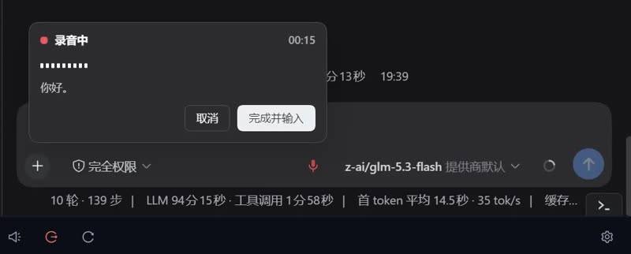

# dsh-voice-input-qwen-asr

[简体中文](./README.zh.md) · English

A [DeepSeek Harness (DSH)](../deepseek-harness) dual-face plugin that adds **voice input** to the chat composer: a mic button next to the send action, a live recording bubble, and a local **Qwen3-ASR** inference service managed entirely by the host.

## Demo

<p align="center">
  <a href="assets/demo/asr-demo.mp4">
    
  </a>
</p>

*▶ Click the frame to play on GitHub (opens the built-in video player) · or [download the clip](assets/demo/asr-demo.mp4).*

## Features

- **Mic button** — registered into the `conversation.input.right` slot, rendered on the left of the composer's send button. Click to start, click again (or press "Done, insert") to stop.
- **Recording bubble** — a portal-anchored bubble with a pulsing indicator, RMS-driven wave bars, elapsed time, and the live partial transcript streamed back from ASR.
- **Real-time streaming** — the browser captures 16 kHz PCM16 mono via AudioWorklet and pushes chunks over a host-relayed WebSocket (`/api/dsh-voice-input-qwen-asr.ws`) to the local ASR service; partial transcripts stream back in real time.
- **Local ASR service** — the host half spawns `python/asr_server.py` with the runtime virtualenv's Python. The server loads `Qwen3-ASR-0.6B` (transformers backend, CUDA when available) and serves a WebSocket transcription endpoint.
- **Environment setup page** — a `settings.section` page ("Voice") that clones the runtime repo and model repo, creates a Python virtualenv inside the runtime directory, installs dependencies, starts/stops the service, and streams install/server logs.

## Requirements

- DSH host with `webServer` + `connection` services (web profile)
- `git` (and **git-lfs** — model weights are distributed via LFS)
- Python **3.12+** (on `PATH`, or an absolute path configured in settings)
- Optional: NVIDIA GPU + CUDA for fast inference; CPU fallback works but is slow

## Install

```sh
dsh plugin --profile web add ./dsh-voice-input-qwen-asr   # or npm name / .tgz / github:you/repo#sha
dsh --profile web --dump-config                  # verify the layer
dsh --profile web                                # restart the host
```

## Usage

1. Open **Settings → Voice**, press **Install all** (or run the four steps individually): clone runtime → clone model → create virtualenv → install deps. Watch the install log; the deps step downloads torch and may take a while. `pip` mirror can be configured on the same page.
2. Press **Start service** and wait until the state chip turns "Running" (device shows `cuda:0` or `cpu`).
3. In any chat, click the mic button left of the send button, speak, then press **Done, insert** — the recognized text is appended to the input draft. "Cancel" discards the recording.

## Architecture

```
browser                          host (Node)                      local python
┌─────────────────┐   POST /dsh-voice-input-qwen-asr/api   ┌──────────────┐
│ mic button      │ ────────────────────────────▶ │ ops: status  │
│ bubble (portal) │                               │ install / sv │
│ settings page   │   WS /api/dsh-voice-input-qwen-asr.ws  │ installer    │
│  AudioWorklet   │ ────────────────────────────▶ │ relay (ws)   │──▶ ws://127.0.0.1:18787/ws
│  PCM16 @16k     │ ◀──────────────────────────── │              │    asr_server.py
└─────────────────┘    partial / final JSON        └──────────────┘    Qwen3-ASR-0.6B
```

- `src/host/` — cordis plugin: HTTP API route (trust-fenced), WebSocket upgrade route (connection-service auth), installer (git clone / venv / pip), ASR process manager, relay hub, JSON store at `$DSH_HOME/dsh-voice-input-qwen-asr.json`.
- `src/client/` — browser plugin: `conversation.input.right` + `settings.section` slots, i18n (zh/en), styles, mic capture, WS client.
- `python/asr_server.py` — asyncio + `websockets` server; buffers incoming PCM, periodically transcribes a tail window for partials, transcribes the full buffer on `stop`.

## Build

```sh
pnpm install
pnpm run check    # tsc -b (host + client programs)
pnpm run build    # → lib/index.js (node) + lib/client.js (browser factory)
pnpm run verify   # simulate host module loader, assert factory shape
```

## License

MIT
